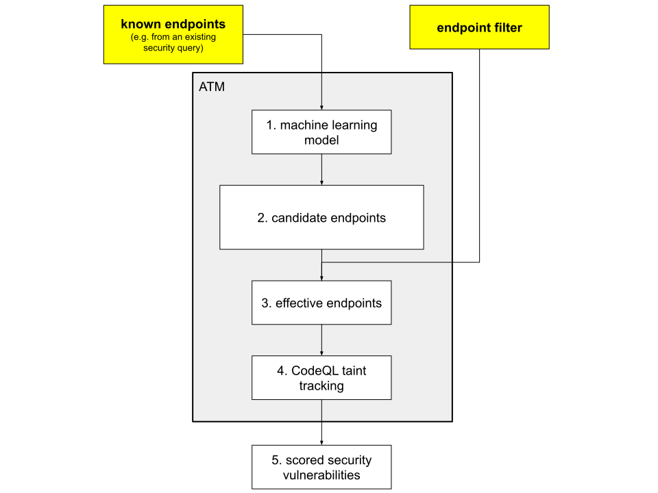

# About adaptive threat modeling

**Note: Adaptive threat modeling is in beta and subject to change.
It is currently only available for JavaScript and TypeScript code.**

Adaptive threat modeling (ATM) is an extension for CodeQL that uses machine learning to boost queries to find more security vulnerabilities.

A "threat model" is a specification of potential security holes in a software application. Typical security queries, available from the [CodeQL repository](https://github.com/github/codeql), use manually supplied threat models. But threat models are often incomplete. ATM is a semi-automatic method to adaptively enlarge, or boost, manually defined threat models. Boosted queries can identify security vulnerabilities that were missed by the original query.

ATM is for existing CodeQL users who want to find more security vulnerabilities in JavaScript codebases. Specifically, you may want to use ATM if:

- you already write CodeQL JavaScript and TypeScript security queries.
- you are a security researcher who wants to find vulnerabilities in JavaScript and TypeScript code.

For example, GitHub's internal JavaScript security team used ATM to surface previously unknown NoSQL injection sinks (across 50 JavaScript projects) that generated 118 new candidate security vulnerabilities.

## Using adaptive threat modeling to boost security queries

Almost any security query, which relies on data flow, can be boosted by ATM.

A typical security query includes a data flow configuration that defines endpoints where user data enters a system (tainted sources) and where it may exit a system to cause a security vulnerability (tainted sinks). These endpoints comprise part of the “threat model” we mentioned earlier. Data flow configurations are manually defined in CodeQL, either in the standard libraries or via bespoke extensions.

However, data flow configurations are always incomplete, which means that queries miss sources and sinks, and therefore miss security vulnerabilities. ATM addresses this problem by predicting additional taint endpoints from known endpoints. 

In most use-cases you write a small amount of QL code to supply the right information to the ATM library. Specifically you must:

- provide a CodeQL data flow configuration for "known endpoints".
- define an "endpoint filter" and then expose this information to the ATM library.

Known endpoints are typically the set of taint endpoints defined by an existing query. For example, if we are boosting a command injection query then the known endpoints are simply the set of sources and sinks defined for this query.

The endpoint filter removes predicted endpoints that cannot be taint sources or sinks. For example, for a command injection query, the endpoint filter should reject candidates that CodeQL knows are not arguments to a function. 

Once you have supplied this information:
1. ATM forwards the known endpoints to a machine learning model.
2. The model predicts a set of candidate endpoints. This step is an over-approximation because ATM predicts lots of candidates and many will not be true endpoints.
3. ATM then applies the endpoint filter to reduce the candidates to a smaller, effective set that is more likely to contain true endpoints.
4. The effective endpoints are forwarded to CodeQL’s data flow analysis.
5. The queries generate a set of security alerts with scores.
    The score for each alert is based on how confident the machine learning model is in the effective endpoints.
    It is not related to the feasibility of the flow between a source and a sink.

Results with higher scores are more likely to be actual security vulnerabilities (true positives) than results with lower scores (which may be false positives). ATM uses experimental machine learning techniques and therefore you should expect a higher incidence of false positives in boosted queries compared to standard CodeQL security queries.

Note that a boosted query only generates additional results not found by the unboosted query.
For full coverage, run the boosted query and the standard query together.

## Refining your results

You can help ATM find more security vulnerabilities in two ways:

- You can improve the recall and precision of the known endpoints by adding more true positives to and removing any false positives from the set of known endpoints.
  This will improve the scoring, increasing the likelihood that higher scoring results are true positives.
- You can refine the endpoint filter such that it allows more true candidate endpoints to pass through and excludes more false candidate endpoints.
  This has the effect of increasing the number of true positives and reducing the number of false positives.

## Further reading

- [GitHub Security Lab](https://securitylab.github.com/)
- [CodeQL for JavaScript](https://help.semmle.com/QL/learn-ql/javascript/ql-for-javascript.html)
